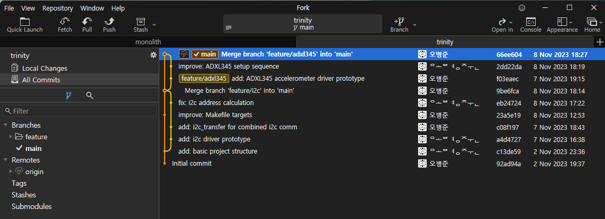

# trinity

## 1. git
### recommendation: [Fork](https://git-fork.com/), a GUI git client


### create your working branch
```sh
git checkout -b feature/<your_branch_name>
```

### merge with origin/main
```sh
git checkout feature/<your_branch_name> # switch to your branch
git merge origin/main
```

### rebase with origin/main
```sh
git rebase origin/main <your_branch_name>
```

## 2. include drivers
```c
#include "driviers/gpio.h"
#include "driviers/pwm.h"
#include "driviers/i2c.h"
```

## 3. build
### all
```sh
make
```
### only specific target
```sh
make rpi-<your_device>
```
ex) `make rpi-amp`

## 4. execute and debug
```sh
./build/rpi-<your_device>
gdb ./build/rpi-<your_device>
```
ex) `./build/rpi-amp`, `gdb ./build/rpi-amp`